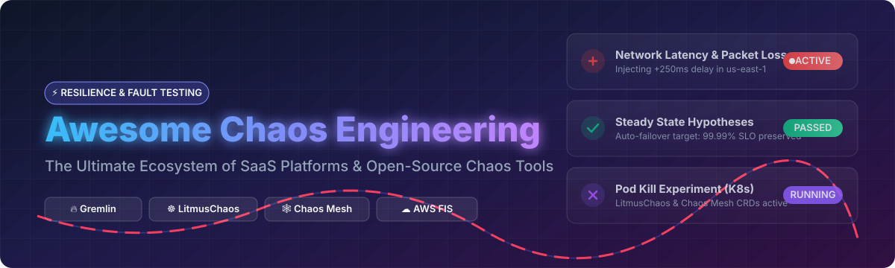

# 💥 Awesome Chaos Engineering Platforms & Ecosystem ⚡

  

  
  
  
  
  
  

> **Curated List of SaaS Products & Open-Source GitHub Projects for Chaos Engineering, Fault Injection, Resilience Testing, Game Days & Reliability Validation.**

---

## 📌 Table of Contents 📖

- [🌐 Market Overview & Ecosystem Dynamics](#-market-overview--ecosystem-dynamics)
- [☁️ SaaS / Commercial Hosted Platforms](#️-saas--commercial-hosted-platforms)
- [🔓 Open-Source GitHub Projects](#-open-source-github-projects)
- [🤝 How to Contribute](#-how-to-contribute)
- [☕ Support & Sponsorship](#-support--sponsorship)
- [⚠️ Disclaimer](#️-disclaimer)
- [📈 Star History](#-star-history)

---

## 🌐 Market Overview & Ecosystem Dynamics 📊

The global Chaos Engineering and Resilience Testing Software market is estimated at **~$1.2 Billion to $1.5 Billion (2025/2026)**, projected to grow at a CAGR of **21.4%** as enterprise Kubernetes adoption, cloud microservices, and strict reliability (SLO/SLA) mandates accelerate.

### Market Structure & Dynamics 🏗️
* **Market Fragmentation:** The sector is **moderately fragmented**. 
* **Dynamics:** While tech giants like AWS (Fault Injection Simulator) and Azure (Chaos Studio) dominate cloud-native agentless fault injection for their respective infrastructure, standalone leaders like Gremlin and Steadybit hold significant enterprise market share. Concurrently, the cloud-native open-source ecosystem (CNCF LitmusChaos, Chaos Mesh) dominates Kubernetes workloads, preventing a single "winner-take-all" outcome.

---

## ☁️ SaaS / Commercial Hosted Platforms 💼

| SaaS Platform / Company 🏢 | Company Size / Valuation / Funding 💰 | Starting Paid Tier Pricing 💵 | Free Tier / Trial Limits 🎁 | Description 📝 |
| :--- | :--- | :--- | :--- | :--- |
| **[AWS Fault Injection Simulator (FIS)](https://aws.amazon.com/fis/)** | **~$2.5+ Trillion** (Amazon Market Cap) | **$0.10 per action-minute** | **No ongoing free tier**; AWS Free Tier includes 100 action-minutes/month for first 12 months. | AWS-native agentless chaos and fault injection service governed by IAM and CloudWatch. |
| **[Azure Chaos Studio](https://azure.microsoft.com/products/chaos-studio)** | **~$3.0+ Trillion** (Microsoft Market Cap) | **$1.00 per target-experiment-hour** | **1 free target-experiment-hour per month**; 30-day $200 Azure free trial credit. | Azure-native controlled fault injection service integrated with Azure RBAC and Monitor. |
| **[Harness Chaos Engineering](https://www.harness.io/)** | **$3.7 Billion** (Valuation, Series D) | **$100 / developer / month** | **Free Forever Tier**: Up to 5 service instances & 50 chaos experiments/mo; 14-day full trial. | Enterprise chaos platform built on LitmusChaos with CI/CD pipeline integration and security governance. |
| **[Gremlin](https://www.gremlin.com/)** | **~$100M - $250M** (Valuation, ~$43M Raised) | **$2,500 / month** (Pro Tier) | **Free Forever Tier**: 1 team, 5 targets, scenarios & basic attacks; 30-day enterprise trial. | Enterprise chaos engineering platform featuring automated reliability management and safety guardrails. |
| **[Steadybit](https://www.steadybit.com/)** | **~$30M - $50M** (Valuation, ~$8M Raised) | **$750 / month** (Team Tier) | **Free Forever Tier**: Up to 5 targets & unlimited basic experiments; 14-day full Pro trial. | Commercial resilience and chaos platform focused on team-approachable experiments and optional self-hosting. |
| **[LitmusChaos Cloud](https://litmuschaos.io/)** | **CNCF Ecosystem** (~$15M Raised) | **$50 / agent / month** | **Free Forever Tier**: 3 agents & 100 workflow runs/mo on ChaosCenter SaaS. | Hosted control plane and enterprise support built around the open-source CNCF LitmusChaos project. |

---

## 🔓 Open-Source GitHub Projects 🚀

Below is a curated list of top open-source chaos engineering frameworks, fault injection utilities, and resilience libraries sorted by GitHub Stars_Count:

1. **[Netflix / chaosmonkey](https://github.com/Netflix/chaosmonkey/stargazers)**  
     
   ⚡ *The foundational open-source tool created by Netflix for randomly terminating EC2 instances in production to validate system resilience.*

2. **[Shopify / toxiproxy](https://github.com/Shopify/toxiproxy/stargazers)**  
     
   ⚡ *TCP proxy to simulate network and system conditions (latency, bandwidth throttling, connection dropouts) specifically for testing resilience.*

3. **[linkerd / linkerd2](https://github.com/linkerd/linkerd2/stargazers)**  
     
   ⚡ *CNCF ultra-fast service mesh for Kubernetes providing traffic splitting, fault injection, and latency simulation.*

4. **[resilience4j / resilience4j](https://github.com/resilience4j/resilience4j/stargazers)**  
     
   ⚡ *Lightweight fault tolerance library designed for Java 8+ and functional programming (Circuit Breaker, Rate Limiter, Retry, Bulkhead).*

5. **[chaos-mesh / chaos-mesh](https://github.com/chaos-mesh/chaos-mesh/stargazers)**  
     
   ⚡ *CNCF incubating open-source chaos engineering platform for Kubernetes with pod, network, I/O, stress, time, and kernel fault injection.*

6. **[chaosblade-io / chaosblade](https://github.com/chaosblade-io/chaosblade/stargazers)**  
     
   ⚡ *Powerful experimental chaos engineering tool supporting multiple platforms (K8s, Docker, OS, C++, Java, Node.js).*

7. **[litmuschaos / litmus](https://github.com/litmuschaos/litmus/stargazers)**  
     
   ⚡ *CNCF incubating open-source chaos engineering platform for Kubernetes featuring ChaosCenter, ChaosHub, and declarative workflows.*

8. **[fortio / fortio](https://github.com/fortio/fortio/stargazers)**  
     
   ⚡ *Fortio load testing library, server, and management tool originally created for Istio to test microservices resilience under load.*

9. **[alexei-led / pumba](https://github.com/alexei-led/pumba/stargazers)**  
     
   ⚡ *Chaos testing and network emulation tool for Docker containers and clusters (kill, pause, stop, stress, netem).*

10. **[asobti / kube-monkey](https://github.com/asobti/kube-monkey/stargazers)**  
      
    ⚡ *An implementation of Netflix's Chaos Monkey for Kubernetes clusters—randomly deletes pods in pre-configured scheduling windows.*

11. **[chaostoolkit / chaostoolkit](https://github.com/chaostoolkit/chaostoolkit/stargazers)**  
      
    ⚡ *Open-source, extensible CLI toolkit for defining chaos experiments declaratively across clouds, Kubernetes, and applications.*

12. **[powerfulseal / powerfulseal](https://github.com/powerfulseal/powerfulseal/stargazers)**  
      
    ⚡ *Kubernetes chaos engineering tool for randomly killing pods and bringing down cluster nodes according to policy scenario files.*

13. **[chaos-mesh / chaosd](https://github.com/chaos-mesh/chaosd/stargazers)**  
      
    ⚡ *Physical node and virtual machine chaos tool developed by the Chaos Mesh project for non-Kubernetes Linux environments.*

---

## 🤝 How to Contribute 🛠️

Contributions are welcome! Please follow these simple guidelines:

1. 🍴 **Fork** this repository.
2. 🌿 Create a new feature branch (`git checkout -b feature/add-chaos-tool`).
3. ✏️ Add your entry in alphabetical or star-ranked order following the existing format.
4. 💬 Commit your changes (`git commit -m 'Add New Chaos Platform'`).
5. 🚀 Push to your branch and submit a **Pull Request**.

Refer to our main list repository at [Awesome-Awesome-Awesome](https://github.com/ishandutta2007/Awesome-Awesome-Awesome) for guidelines on awesome list curation.

---

## ☕ Support & Sponsorship 💖

If you find this repository helpful for your SRE team, platform engineering journey, or chaos engineering research, please consider supporting the project:

* ⭐ **Star this repository** to help others discover it!
* 🔀 **Fork & Share** it with your fellow engineers and SRE communities.
* ☕ **Buy me a coffee / Sponsor**: If you'd like to support ongoing open-source curation and maintenance, visit my [GitHub Sponsor Dashboard](https://github.com/sponsors/ishandutta2007).

Thank you for being part of the open-source reliability community! 🙌

---

## ⚠️ Disclaimer 🔒

* This list is **community-curated** for educational, SRE, and platform engineering reference only.
* Chaos engineering intentionally disrupts production environments. Always start with a small blast radius, configure strict safety guardrails, and secure proper authorization before running experiments.

---

## 📈 Star History 📊

---

  <b>Made with ❤️ for SREs, DevOps, and Reliability Engineers worldwide.</b>

